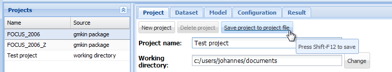
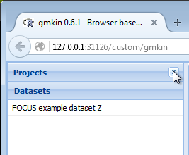
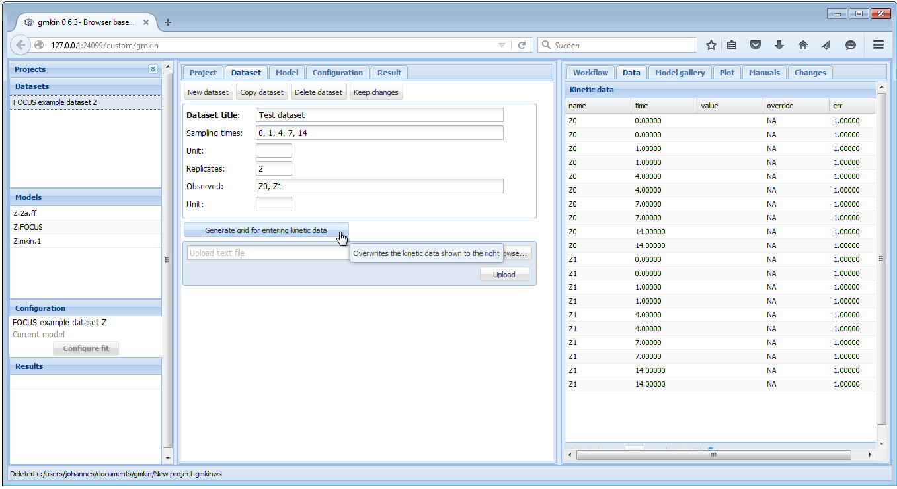
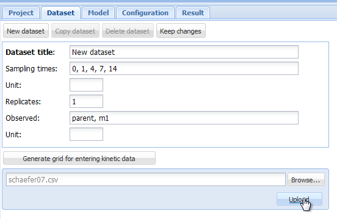
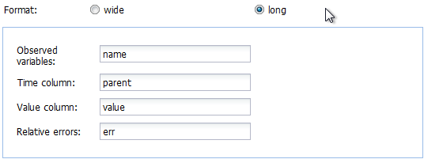
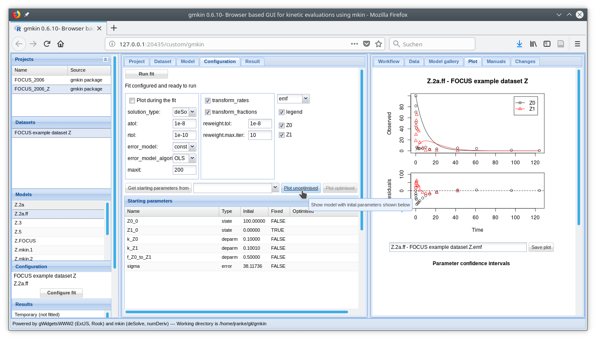

```{r, include = FALSE}
library(knitr)
opts_chunk$set(tidy = FALSE, cache = FALSE)
```
## Introduction

The R add-on package gmkin provides a browser based graphical interface for
performing kinetic evaluations of degradation data using the 
[mkin package](http://kinfit.r-forge.r-project.org/mkin_static).
While the use of gmkin should be largely self-explanatory, this manual may serve
as a functionality overview and reference.

For system requirements and installation instructions, please refer to the 
[gmkin homepage](http://kinfit.r-forge.r-project.org/gmkin_static).

## Starting gmkin

As gmkin is an R package, you need to start R and load the gmkin package before you can run gmkin. 
The latter can be achieved by entering the command

```{r, eval = FALSE}
library(gmkin)
```

into the R console. This will also load the packages that gmkin depends on,
most notably gWidgetsWWW2 and mkin. Loading the package only has to be done
once after you have started R. 

Before you start gmkin, you should make sure that R is using the working
directory that you would like to keep your gmkin project file(s) in. If you use
the standard R GUI application on windows, you can change the working directory
from the File menu ('File' -> 'Change dir...').

Once you are sure that the working directory is what you want it to be, gmkin
can be started by entering the R command

```{r, eval = FALSE}
gmkin()
```

This will cause the default browser to start up or, if it is already running, to
pop up and open a new tab for displaying the gmkin user interface.

In the R console, you should see a message that the httpd help server is started, if it wasn't
already started before.

In the browser, you should see something like the screenshot below.


The statusbar at the bottom of the gmkin window shows, among others, the
working directory that gmkin uses.

If the browser only shows "Loading ExtJS..." and nothing else happens for about 10 to 15 seconds,
please enter the `gmkin()` command again in the R console. If this still does not bring up the
gmkin GUI, please close the browser and try again.

## Three column layout

Since version 0.6.1, gmkin adheres to a three column layout. To the left, there are explorer
areas for the available projects, datasets, kinetic models and the completed fits.

In the central, tabbed area, the projects, datasets, models and fits are defined. The area
to the right is mainly for showing information intended to support the user, and results.
However, it also contains a tab 'Data' for editing kinetic data.

## Project file management

At startup, the project explorer to the left shows the two project workspaces 'FOCUS_2006' and 
'FOCUS_2006_Z' delivered with the package. The project manangement area in the
center gives the possibility to save these projects under a new name, or to
start a new, empty project.

A gmkin project workspace contains datasets, kinetic models for fitting, and
so-called fits, i.e. the results of fitting models to data. The project area also shows the current
working directory, where project workspace files are saved using the file extension `.gmkinws`.

Once a project has been saved by the user, the project explorer to the left will show it in the 
project list.



The current state of a project should repeatedly be saved during the work in order to avoid
loosing data. This can be achieved by selecting the 'Project' tab in the center and pressing 
the 'Save project to project file' button. More conveniently, the keyboard shortcut Ctrl-X
can be used to save the current status of the project.

In the project file management area, datasets and models can be imported from 
one of the projects in the project list, once it has been selected in the 
droplist labelled 'Import from:'.


Once the project has been set up, you may want to minimize the project explorer, especially
if you are limited in vertical screen space.



## Dataset editor

When you select one of the datasets in the dataset explorer to the left, some 
summary information about the dataset is shown in the center, and the data itself
is loaded into the data editor to the right.


When you have added information about the units, or edited the data to the right, you should hit
the button 'Keep changes'. This will add a new entry in the dataset explorer.

In the dataset editor to the right, you can override original data (for example in order to 
follow FOCUS recommendations for time zero samples or values below the limit of detection) 
by entering numbers in the override column.

When saving a dataset, the sampling times, the number of replicates and the list of observed
variables will be computed from the current data in the data editor.

However, entering data in these fields is a prerequisite for entering a new dataset directly
in the dataset editor.

### Entering data directly

For entering new data manually, there are two possibilities. You can either
change the Dataset title of the current dataset and edit the data in the Data
editor to the right. Or, if the new data should have a different structure, e.g.
different sampling times, observed variables and replicates, click on "New
dataset", edit the dataset title, sampling times, number of replicates and the list of
observed variables, and press the button 'Generate grid for entering kinetic data', in
order to prepare the Data editor to the right.

For sampling times and short names of the relevant compounds, a comma separated
list must be entered, with a space after each comma.  An example of filling out
the respective fields is shown below.



After that, the actual measurements can be entered into the Data editor to the right, in the
column 'value'.

If everything is OK, press "Keep changes" to save the dataset in the current
workspace. Note that you need to save the project file (see above) in order to
be able to use the dataset that you created in a future gmkin session.

### Importing data from text files

In case you want to work with a larger dataset that is already available as a computer 
file e.g. in a spreadsheet application, you can export these data as a tab separated
or comma separated text file and import it using the "Browse" and "Upload" buttons in the
dataset editor.

As an example, we can create a text file from one of the datasets shipped with
the mkin package using the following R command:

```{r, eval = FALSE}
write.table(schaefer07_complex_case, sep = ",", dec = ".", 
            row.names = FALSE, quote = FALSE, 
            file = "schaefer07.csv")
```

This produces a text file with comma separated values in the current working directory of R. 

Loading this text file into gmkin using the "Browse" and "Upload" buttons 



results in an an import configuration area showing the top lines of the imported file, and
giving the possibility to chose the import options matching the file format.


In the import configuration area, the following options can be specified. In the field
"Comment lines", the number of lines in the beginning of the file that should be ignored
can be specified.

The checkbox on the next line should be checked if the first line of the file contains
the column names, i.e. the names of the observed variables when the data are in wide format.

As "Separator", whitespace, semicolon or comma can be chosen. If whitespace is selected,
files in which the values are separated by a fixed or varying number of whitespace characters
should be read in correctly. As the tabulator counts as a whitespace character, this is 
also the option to choose for tabulator separated values.

As the "Decimal" separator, comma "," or period "." can be selected.

In the next line, it can be specified if the data are in wide or in long format.
If in wide format, the only option left to specify is the title of the column containing
the sampling times. If the data is in long format, the column headings specifying the 
columns containing the observed variables (default is "name"), the sampling times
(default is "time"), the observed values (default is "value") and, if present in the data,
the relative errors (default is "err") can be adapted. The default settings appearing if
the long format is selected are shown below.



In our example we have data in the wide format, and after adapting the
"Separator" to a comma, we can press the button "Import using options specified
below", and the data should be imported.  If successful, the dataset editor should
show the sampling times and the names of the observed variables, and the Data editor
should show the imported data in a grid for further editing or specifying
overrides.


After adapting the dataset title and possibly the units, press
"Keep changes" to save the dataset in the current workspace. Again, you need to
save the project file in order to be able to use the dataset that you created
in a future gmkin session.

## Model editor

The following screenshot shows the model editor for the model 'Z.2a.ff' from 
the project workspace 'FOCUS_2006_Z' provided with the gmkin package.


In the first line the name of the model can be edited. You can also specify "min" or
"max" for minimum or maximum use of formation fractions. Maximum use of formation
fractions means that the differential equations in the degradation model are formulated
using formation fractions. When you specify "min", then formation fractions are only used
for the parent compound when you use the FOMC, DFOP or the HS model for it.

Pressing "Add observed variable" adds a line in the array of state variable specifications below.
The observed variables to be added are usually transformation products (usually termed metabolites),
but can also be the parent compound in a different compartment (e.g. "parent\_sediment").

Only observed variable names that occur in previously defined datasets or
models can be selected. For any observed variable other than the first one,
only the SFO or the SFORB model can be selected. For each observed variables, a
comma separated list of target variables can be specified. In addition, a
pathway to the sink compartment can be selected. If too many observed variables
have been added, complete lines can be removed from the model definition by
pressing the button "Remove observed variable".

If the model definition is supposedly correct, press "Keep changes" to make it possible to select
it for fitting in the listing of models to the left.

## Configuring the fit

If a dataset and a kinetic model are selected, the button "Configure fit" below
in the Explorer window "Configuration" becomes active. Pressing it opens the "Configuration"
area in the center and loads the dataset into the Data editor to the right, for viewing only.

After pressing the button 'Plot unoptimised', the data and the kinetic model with default 
starting parameters are plotted in the 'Plot' area to the right.



### Fit options

The most important fit options of the `mkinfit` function can be set via the 
controls in the fit configuration area shown above. If the "plot" checkbox is
checked (and on Windows, the R GUI is used for running gmkin), an R graphics
device started via the R console shows the fitting progress, i.e. the change of
the model solution together with the data during the optimisation.

The "solution\_type" can either be "auto", which means that the most effective solution
method is chosen for the model, in the order of "analytical" (for parent only degradation
data), "eigen" (for differential equation models with only linear terms, i.e. without 
FOMC, DFOP or HS submodels) or "deSolve", which can handle all model definitions generated
by the `mkin` package. If a compiler (gcc, on Windows install the 'Rtools' software package),
then the "deSolve" solution method is alway chosen when there are more than one
variables in the model.

The parameters "atol" and "rtol" are only effective if the solution type is "deSolve". They
control the precision of the iterative numerical solution of the differential equation model.

The checkboxes "transform\_rates" and "transform\_fractions" control if the parameters are fitted
as defined in the model, or if they are internally transformed during the fitting process in 
order to improve the estimation of standard errors and confidence intervals which are based 
on a linear approximation at the optimum found by the fitting algorithm.

If fitting with transformed fractions leads to a suboptimal fit, doing a first
run without transforming fractions may help. A final run using the optimised
parameters from the previous run as starting values (see comment on "Get
initials from" above) can then be performed with transformed fractions.

The dropdown box "weight" specifies if and how the observed values should be weighted 
in the fitting process. If "manual" is chosen, the values in the "err" column of the 
dataset are used, which are set to unity by default. Setting these to higher values 
gives lower weight and vice versa. If "none" is chosen, observed
values are not weighted. Please refer to the documentation of the `modFit` function from
the `FME` package for the meaning of options "std" and "mean".

If the "IRLS" option is set to "obs", then we make use of iteratively
reweighted least squares fitting.  Please refer to the `mkinfit`
[documentation](http://kinfit.r-forge.r-project.org/mkin_static/mkinfit.html)
for more details. IRLS fitting can be configured using the options
"reweight.tol" and "reweight.max.iter".

The drop down box "method.modFit" makes it possible to choose between the optimisation
algorithms "Port" (the default in mkin versions > 0.9-33, a local optimisation
algorithm using a model/trust region approach), "Marq" (the former default in
mkin, a Levenberg-Marquardt variant from the R package `minpack.lm`), 
and "SANN" (the simulated annealing method - robust but inefficient and without
a convergence criterion).

Finally, the maximum number of iterations for the optimisation can be adapted using the
"maxit.modFit" field.

### Plot options

In the right part of the fit configuration area, the file format can be chosen,
the legend can be turned off, and the observed variables for which the data and
the model fit should be plotted can be selected as shown below.


On systems running the Windows operating system, the windows metafile (wmf) format
can be additionally chosen. Changing the file format for plotting will also change 
the extension of the proposed filename for saving the plot.

### Parameters

Below the fit control area, a table with the Starting parameter list is displayed. While 
name and type of the parameters should not be edited, their initial values can be edited
by clicking on a row. Also, it can be specified if the parameters should be fixed
in the optimisation process. 

If the initial values for the parameters were changed, the resulting model solution
can be visually checked by pressing the button "Plot unoptimised". This will update the 
plot of the model and the data using the specified initial parameter values.

If a similar model with a partially overlapping model definition has already be fitted, 
initial values for parameters with the same name in both models can also be retrieved
from previous fits by selecting the fit and pressing the button "Get starting parameters
from". This facilitates stepwise fitting of more complex degradation pathways.

After the model has been successfully fitted by pressing the "Run fit" button, the optimised
parameter values are added to the parameter table.

### Fitting the model

In many cases the starting parameters and the fit options do not need to be modified
and the model fitting process can simply be started by pressing the "Run fit" button.
In the R console, the progressive reduction in the model cost can be monitored and will 
be displayed in the following way:

```{r, eval = FALSE}
Model cost at call  1 :  15156.12 
Model cost at call  3 :  15156.12 
Model cost at call  7 :  14220.79 
Model cost at call  8 :  14220.79 
Model cost at call  11 :  14220.79 
Model cost at call  12 :  3349.268 
Model cost at call  15 :  3349.268 
Model cost at call  17 :  788.6367 
Model cost at call  18 :  788.6366 
Model cost at call  22 :  374.0575 
Model cost at call  23 :  374.0575 
Model cost at call  27 :  371.2135 
Model cost at call  28 :  371.2135 
Model cost at call  32 :  371.2134 
Model cost at call  36 :  371.2134 
Model cost at call  37 :  371.2134 
Optimisation by method Port successfully terminated.
```

If plotting of the fitting progress was selected, a new separate graphics
window should either pop up, or a graphics window previously started for this
purpose will be reused.

If your screen size allows for it, you can arrange the R plotting window and the 
R console in a way that you can see everything at the same time:


## Results and summary

Once a fit has successfully been completed, the most important results are shown in several
tables in the "Result" area as shown below. 


The detailed summary can be accessed below these tables.


The complete summary can be saved into a text file by specifying a suitable file name
and pressing the button "Save summary".

### Confidence interval plots

Whenever a new fit has been configured or a run of a fit has been completed, the plotting
area is updated with the abovementioned plot of the data and the current model solution.

In addition, a confidence interval plot is shown below this conventional plot. In case
a fit has been run and confidence intervals were successfully calculated for the fit (i.e. 
if the model was not overparameterised and no other problems occurred), the 
confidence intervals are graphically displayed as bars as shown below.


<!-- vim: set foldmethod=syntax ts=2 sw=2 expandtab: -->
