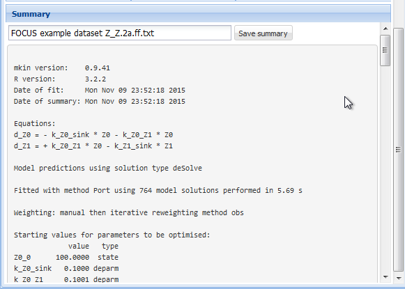

<!--
%\VignetteEngine{knitr::rmarkdown}
%\VignetteIndexEntry{Manual for gmkin}
-->

```{r, include = FALSE}
library(knitr)
opts_chunk$set(tidy = FALSE, cache = TRUE)
```
## Introduction

The R add-on package gmkin provides a browser based graphical interface for
performing kinetic evaluations of degradation data using the mkin package.
While the use of gmkin should be largely self-explanatory, this manual may serve
as a functionality overview and reference.

For system requirements and installation instructions, please refer to the 
[gmkin homepage](http://kinfit.r-forge.r-project.org/gmkin_static)

## Starting gmkin

As gmkin is an R package, you need to start R and load the gmkin package before you can run gmkin. 
This can be achieved by entering the command

```{r, eval = FALSE}
library(gmkin)
```

into the R console. This will also load the packages that gmkin depends on,
most notably gWidgetsWWW2 and mkin.  Loading the package only has to be done
once after you have started R. 

Before you start gmkin, you should make sure that R is using the working
directory that you would like to keep your gmkin project file(s) in. If you use
the standard R application on windows, you can change the working directory
from the File menu.

Once you are sure that the working directory is what you want it to be, gmkin
can be started by entering the R command

```{r, eval = FALSE}
gmkin()
```

This will cause the default browser to start up or, if it is already running, to
pop up and open a new tab for displaying the gmkin user interface.

In the R console, you should see some messages, telling you if the local R help
server, which also serves the gmkin application, has been started, which port it is
using and that it is starting an app called gmkin.

Finally, it should give a message like

```{r, eval = FALSE}
Model cost at call 1: 2388.077
```

which means that the first kinetic evaluation has been configured for fitting.

In the browser, you should see something like the screenshot below.


The statusbar at the bottom of the gmkin window shows, among others, the
working directory that gmkin uses.

Note that the project file management area described below can be minimized by clicking on 
the arrows on the right hand side of its title bar. This may be helpful if the vertical
size of your browser window is restricted.

## Project file management

At startup, gmkin loads a project called "FOCUS\_2006\_gmkin" which is distributed
with the gmkin package. A gmkin project contains datasets, kinetic models for
fitting, and so-called fits, i.e. the results of fitting models to data. These
gmkin projects can be saved and restored using the project file management area in the
top left.


If you would like to save these items for reference or for the purpose of continuing 
your work at a later time, you can modify the project name and press the button below it.
The full name of the project file created and the working directory will be displayed 
in the gmkin status bar.

For restoring a previously saved project file, use the Browse button to locate
it, and the "Upload" button to load its contents into gmkin.

## Studies

The "Studies" area directly below the "Project file management" area can be expanded by clicking
on the arrows on the right hand side of its title bar. Studies in gmkin are
simply a numbered list of sources for the datasets in a project. You can edit the titles 
directly by clicking on them. If you would like to add a new data source, use the "Add"
button above the table containing the list. If there are more than one studies in the list,
you can also remove them using the "Remove" button.


Note that the user is responsible to keep the study list consistent with the numbers that are 
used in the list of datasets described below.

## Datasets and Models
The project loaded at the start of gmkin contains two datasets and four kinetic models. These 
are listed to the left under the heading "Datasets and Models", together with a button for 
setting up fits as shown below.


For editing, adding or removing datasets or models, you need to double-click on an
entry in the respective list. 

For setting up a fit of a specific model to a specific dataset, the model and
the dataset should be selected by clicking on them. If they are compatible, clicking
the button "Configure fit for selected dataset and model" will set up the fit and 
open the "Plotting and Fitting" tab to the right.

## Dataset editor

The dataset editor allows for editing datasets, entering new datasets, uploading
data from text files and deleting datasets.


If you want to create (enter or load) a new dataset, it is wise to first edit
the list of data sources in the "Studies" area as described above.

### Entering data directly

For entering new data manually, click on "New dataset", enter a title and select
the study from which the dataset is taken. At this stage, you may already want
to press "Keep changes", so the dataset appears in the list of datasets.

In order to generate a table suitable for entering the data, enter a comma separated
list of sampling times, optionally the time unit, and the number of replicate measurements
at each sampling time. Also, add a comma separated list of short names of the
relevant compounds in your dataset. A unit can be specified for the observed 
values. An example of filling out the respective fields is shown below.


Once everyting is filled out to your satisfaction, press the button "Generate empty grid
for kinetic data". In our example, this would result in the data grid shown below. You 
can enter the observed data into the value column, as shown in the screenshot below.


The column with title override serves to override data points from the original
datasets, without loosing the information which value was originally reported.

If everything is OK, press "Keep changes" to save the dataset in the current
workspace. Note that you need to save the project file (see above) in order to
be able to use the dataset that you created in a future gmkin session.

### Importing data from text files

In case you want to work with a larger dataset that is already available as a computer 
file e.g. in a spreadsheet application, you can export these data as a tab separated
or comma separated text file and import it using the "Browse" and "Upload" buttons in the
dataset editor.

As an example, we can create a text file from one of the datasets shipped with
the mkin package using the following R command:

```{r, eval = FALSE}
write.table(schaefer07_complex_case, sep = ",", dec = ".", 
            row.names = FALSE, quote = FALSE, 
            file = "schaefer07.csv")
```

This produces a text file with comma separated values in the current working directory of R. 

Loading this text file into gmkin using the "Browse" and "Upload" buttons results in 
an import configuration area like this, with the uploaded text file displayed to the left,
and the import options to the right.


In the import configuration area, the following options can be specified. In the field
"Comment lines", the number of lines in the beginning of the file that should be ignored
can be specified.

The checkbox on the next line should be checked if the first line of the file contains
the column names, i.e. the names of the observed variables when the data are in wide format.

As "Separator", whitespace, semicolon or comma can be chosen. If whitespace is selected,
files in which the values are separated by a fixed or varying number of whitespace characters
should be read in correctly. As the tabulator counts as a whitespace character, this is 
also the option to choose for tabulator separated values.

As the "Decimal" separator, comma "," or period "." can be selected.

In the next line, it can be specified if the data are in wide or in long format.
If in wide format, the only option left to specify is the title of the column containing
the sampling times. If the data is in long format, the column headings specifying the 
columns containing the observed variables (default is "name"), the sampling times
(default is "time"), the observed values (default is "value") and, if present in the data,
the relative errors (default is "err") can be adapted. The default settings appearing if
the long format is selected are shown below.


In our example we have data in the wide format, and after adapting the
"Separator" to a comma, we can press the button "Import using options specified
below", and the data should be imported.  If successful, the data editor should
show the sampling times and the names of the observed variables, as well as the
imported data in a grid for further editing or specifying overrides.

After editing the title of the dataset and selecting the correct study as 
the source of the data, the dataset editor should look like shown below.


If everything is OK, press "Keep changes" to save the dataset in the current
workspace. Again, you need to save the project file in order to be able to use
the dataset that you created in a future gmkin session.

## Model editor

The following screenshot shows the model editor for the model number 4 in 
the list of models that are in the initial workspace.


In the first line the name of the model can be edited. You can also specify "min" or
"max" for minimum or maximum use of formation fractions. Maximum use of formation
fractions means that the differential equations in the degradation model are formulated
using formation fractions. When you specify "min", then formation fractions are only used
for the parent compound when you use the FOMC, DFOP or the HS model for it.

Pressing "Copy model" keeps the model name, so you should change it for the newly generated copy.
Pressing "Add observed variable" adds a line in the array of state variable specifications below.
The observed variables to be added are usually transformation products (usually termed metabolites),
but can also be the parent compound in a different compartment (e.g. "parent\_sediment").

Only observed variable names that occur in previously defined datasets can be selected. For any observed 
variable other than the first one, only the SFO or the SFORB model can be selected. For each 
observed variables, a comma separated list of target variables can be specified. In addition, a pathway
to the sink compartment can be selected. If too many observed variables have been added, complete lines
can be removed from the model definition by pressing the button "Remove observed variable".

If the model definition is supposedly correct, press "Keep changes" to make it possible to select
it for fitting in the listing of models to the left.

## Plotting and fitting

If the dataset(s) to be used in a project are created, and suitable kinetic models have been defined,
kinetic evaluations can be configured by selecting one dataset and one model in the lists to the left,
and the pressing the button "Configure fit for selected dataset and model" below these lists.

This opens the "Plotting and fitting" tab area to the right, consisting of a graphical window
showing the data points in the selected dataset and the model, evaluated with the initial parameters
defined by calling `mkinfit` without defining starting parameters. The value of the objective function
to be minimized for these default parameters can be seen in the R console, e.g. as

```{r, eval = FALSE}
Model cost at call 1: 15156.12
```

for the example shown below, where the FOCUS example dataset D and the model SFO\_SFO were selected.


### Parameters

In the right hand area, initially the tab with the parameter list is displayed. While 
name and type of the parameters should not be edited, their initial values can be edited
by clicking on a row. Also, it can be specified if the parameters should be fixed
in the optimisation process. 

If the initial values for the parameters were changed, the resulting model solution
can be visually checked by pressing the button "Show initial". This will update the 
plot of the model and the data using the specified initial parameter values.

If a similar model with a partially overlapping model definition has already be fitted, 
initial values for parameters with the same name in both models can also be retrieved
from previous fits by selecting the fit and pressing the button "Get initials
from". This facilitates stepwise fitting of more complex degradation pathways.

After the model has been successfully fitted by pressing the "Run" button, the optimised
parameter values are added to the parameter table.

### Fit options

The most important fit options of the `mkinfit` function can be set via the 
"Fit option" tab shown below. If the "plot" checkbox is checked, an R graphics device
started via the R console shows the fitting progress, i.e. the change of the model
solution together with the data during the optimisation.


The "solution\_type" can either be "auto", which means that the most effective solution
method is chosen for the model, in the order of "analytical" (for parent only degradation
data), "eigen" (for differential equation models with only linear terms, i.e. without 
FOMC, DFOP or HS submodels) or "deSolve", which can handle all model definitions generated
by the `mkin` package.

The parameters "atol" and "rtol" are only effective if the solution type is "deSolve". They
control the precision of the iterative numerical solution of the differential equation model.

The checkboxes "transform\_rates" and "transform\_fractions" control if the parameters are fitted
as defined in the model, or if they are internally transformed during the fitting process in 
order to improve the estimation of standard errors and confidence intervals which are based 
on a linear approximation at the optimum found by the fitting algorithm.

If fitting with transformed fractions leads to a suboptimal fit, doing a first
run without transforming fractions may help. A final run using the optimised
parameters from the previous run as starting values (see comment on "Get
initials from" above) can then be performed with transformed fractions.

The dropdown box "weight" specifies if and how the observed values should be weighted 
in the fitting process. If "manual" is chosen, the values in the "err" column of the 
dataset are used, which are set to unity by default. Setting these to higher values 
gives lower weight and vice versa. If "none" is chosen, observed
values are not weighted. Please refer to the documentation of the `modFit` function from
the `FME` package for the meaning of options "std" and "mean".

The options "reweight.method", "reweight.tol" and "reweight.max.iter" enable the use of
iteratively reweighted least squares fitting, if the reweighting method is set to "obs". Please
refer to the `mkinfit` [documentation](http://kinfit.r-forge.r-project.org/mkin_static/mkinfit.html) 
for more details.

The drop down box "method.modFit" makes it possible to choose between the optimisation
algorithms "Port" (the default in mkin versions > 0.9-33, a local optimisation
algorithm using a model/trust region approach), "Marq" (the former default in
mkin, a Levenberg-Marquardt variant from the R package `minpack.lm`), 
and "SANN" (the simulated annealing method - robust but inefficient and without
a convergence criterion).

Finally, the maximum number of iterations for the optimisation can be adapted using the
"maxit.modFit" field.

### Fitting the model

In many cases the starting parameters and the fit options do not need to be modified
and the model fitting process can simply be started by pressing the "Run" button.
In the R console, the progressive reduction in the model cost can be monitored and will 
be displayed like this:

```{r, eval = FALSE}
Model cost at call  1 :  15156.12 
Model cost at call  3 :  15156.12 
Model cost at call  7 :  14220.79 
Model cost at call  8 :  14220.79 
Model cost at call  11 :  14220.79 
Model cost at call  12 :  3349.268 
Model cost at call  15 :  3349.268 
Model cost at call  17 :  788.6367 
Model cost at call  18 :  788.6366 
Model cost at call  22 :  374.0575 
Model cost at call  23 :  374.0575 
Model cost at call  27 :  371.2135 
Model cost at call  28 :  371.2135 
Model cost at call  32 :  371.2134 
Model cost at call  36 :  371.2134 
Model cost at call  37 :  371.2134 
```

If plotting of the fitting progress was selecte in the "Fit options" tab, a
new separate graphics window should either pop up, or a graphics window previously
started for this purpose will be reused.

### Summary

Once a fit has successfully been performed by pressing the "Run" button, the summary
as displayed below can be accessed via the "Summary" tab.



The complete summary can be saved into a text file by specifying a suitable file name
and pressing the button "Save summary".

### Plot options

In the tab "Plot options", the file format can be chosen, the legend can be
turned off, and the observed variables for which the data and the model fit
should be plotted can be selected as shown below.


On systems running the Windows operating system, the windows metafile (wmf) format
can be additionally chosen. Chaning the file format for plotting will also change 
the extension of the proposed filename for saving the plot.

### Confidence interval plots

Whenever a new fit has been configured or a run of a fit has been completed, the plotting
area is updated with the abovementioned plot of the data and the current model solution.

In addition, a confidence interval plot is shown below this conventional plot. In case
a fit has been run and confidence intervals were successfully calculated for the fit (i.e. 
if the model was not overparameterised and no other problems occurred), the 
confidence intervals are graphically displayed as bars as shown below.


<!-- vim: set foldmethod=syntax ts=2 sw=2 expandtab: -->
